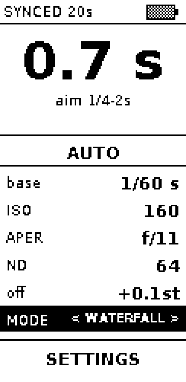
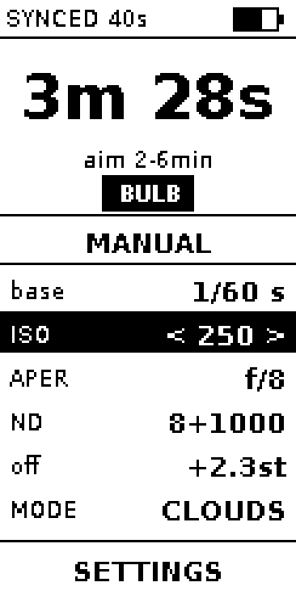
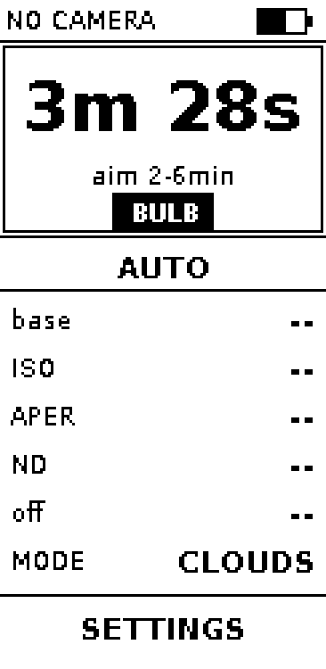

# ND Long Exposure Timer

Taking long exposure photos can be cumbersome. You work forward based on the filters you might want to put on your camera. However working backwards based on the exposure time you desire is much more user friendly.
This way you only need to think about the intended effect you want to create.

Normally
- you first need to determine the correct exposure
- then guess which filters you would need
- then calculate how much the total exposure time will be
- maybe pick different filters and calculate again
- and then backsolve how to adjust:  iso / aperture so your base shutter speed will result in the total exposure time you wanted.

This module will make the whole process shutter priority, and tell you which filters you need, it will take care of the camera settings.
- sync with your camera when you have your exposure set correctly
- let you chose the total exposure time
- it will tell you what filters you need to put on
- it will automatically determine the settings for the long exposure.

no calculations or iterative backsolving required!


It is shutter priority, with the filters in the loop. A camera in that mode balances
the shutter you chose against the one variable it has; this one has your filter bag as
well, and a stop of ND buys time without touching the photograph at all.

- **SYNC** reads ISO, aperture and shutter speed from the camera over USB
- Choose the time you want, or a scenario that knows what it wants
- The panel names the filters to screw on and the ISO and aperture to set

## What it looks like

The display is a 2.13" e-paper panel mounted upright: 122 x 250 pixels. "selected" is shown by inverting the colors.

### The recipe

The time is at the top because it is the one thing you choose. Under it, a band saying
who is choosing everything else. Then **base**, the shutter the camera was reading when
you pressed SYNC - a measurement, which nothing the device does moves - and the answer
to your time, read down the column: the ISO and aperture to set, the filters to screw
on, and how close that lands. At 122 pixels wide there is no room for a label beside its
value, so each row stacks them.

Nothing on screen says SHOOT. It is a button under your thumb, and a panel that drew it
would be spending its own space saying what the hardware already says.


Past 30 seconds the shot has to run on bulb, and the panel says so - the Pi is the timer
from that point on.


Before the first SYNC there is no scene to work back from, and the device says that
rather than printing a recipe it cannot stand behind.


### The battery

The UPS HAT carries an INA219, which measures volts and amps rather than charge -
there is no gauge on the board modelling the cell - so the percentage is inferred
from cell voltage. That is a cruder thing than it looks: a lithium cell sits near
3.7V for most of its life and then falls off a cliff, and it sags under load and
recovers after.

So it is treated as an estimate. The reading is smoothed and reported in steps of
five, which keeps a wandering last digit from costing a panel refresh, and stops
the device claiming 73% when it knows no such thing.

When nothing answers on the bus - no UPS fitted, or I2C never enabled - the
battery is drawn hatched rather than empty. An empty outline says the cell is
dead and sends you home; hatching says the number is not known.



### When the bag cannot get there

Filters come in coarse jumps, so the time asked for is often not reachable with glass
alone. ISO in thirds is the trim that closes the gap - the ISO on screen is simply the
one that makes your time the correct exposure for what was metered, not a change to the
reading itself. The **off** row is what is left over: a signed number of stops, where
positive is brighter than metered, so shoot that time anyway and the frame is over by
that much. It says `exact` only when there is nothing left worth reading.

Aperture is moved last and least, because it is the one thing on the list the photograph
itself can see - and it moves in thirds, so when it has to move it moves by f/11 to f/13
rather than by a whole stop.

The row keeps speaking below the point where the device stops working. A third of a stop
is the finest step a camera has, so one recipe serves every time within half a step of
it: ask for nine minutes or for ten and the filters, the ISO and the aperture are the
same, because nothing on the camera could tell those two apart. They are not the same
photograph though - the second is a minute more cloud - so the row reads `exact` at one
and `+0.1st` at the other, and the difference between the two screens is visible rather
than implied.


### Taking the settings over

**AUTO** is the device choosing: the ISO, the aperture and the filters are all worked
back from your time. Press the five-way's centre on the band - or push it left or right
- and it says **MANUAL**, which hands you the ISO and the aperture. The five-way then
stops on those two rows, because on AUTO they were answers and now they are not.

It starts from whatever AUTO had chosen, so nothing jumps under the press. The filters
do not move: whatever is screwed on stays screwed on, and the ISO and the aperture are
what you turn around it. What changes is the **off** row, which is the whole point of
the mode - the device stops solving and starts telling you where you have got to.



The ceiling and the lens ends from settings still hold: MANUAL is the photographer
choosing within the kit, not the kit being forgotten.

### Setting the time

A scenario is a shortcut to a time rather than a mode of its own: choosing CLOUDS puts
the dial in the middle of what clouds want and the recipe follows. From there the time
is yours. Press the five-way's centre on it and left and right walk the camera's own
third-stop ladder, up and down move a second for the times the ladder skips. Below a
second the screen stops offering them - a second added to 1/8 is three stops, which is a
jump rather than an adjustment - but the press still works, and is often how you leave
the fast end.

While the time is being set the answer is inverted and written as a clock, so a second on
or off moves a digit rather than reflowing the whole number.


The ladder runs from 1/125 to 15s, then 00:16 and whole minutes to an hour - well past what
long exposure needs at the fast end, because waves want 1/8 and a dial that reaches 1/125 is
one a self-timer can be built on later.


A time dialled away from the scenario's own says SET in the status bar. The rows
underneath always agree with the time, so the tag is not about them: it says this time is
yours, and choosing a scenario is how you hand it back.


### Settings

The device can only answer out of the kit it has been told about, so most of settings is
that kit: which filters are in the bag, how far the ISO may be pushed, and the two ends
of the lens. A filter left out of the bag is never asked for and an aperture past either
end is never named - the device would rather miss the time and say so on the **off** row
than tell you to use glass you did not bring. **DELAY** is the exception, and is about
the tripod rather than the camera.

The two ends run in thirds, like the camera's own dial, so an f/3.5-6.3 zoom can be
described exactly rather than rounded to the nearest whole stop. It starts describing
every lens, f/1.4 to f/22, and the whole common filter set, so it is useful before it is
configured rather than empty.


The filter list is the same screen one level down. The centre press is what puts a
filter in the bag or takes it out, so its rows go without the carets that would promise
left and right do something.


### Exposing

The shutter does not open on the press. A finger coming off a button is the worst
vibration a tripod sees all evening, and a long exposure records every bit of it, so
SHOOT starts a delay and the exposure is counted from the shutter rather than from the
button. Eight seconds by default, which is long enough for the thing to stop ringing and
short enough not to be something you work around; **DELAY** in settings takes it from
`off` to thirty seconds.

The panel says so once and then leaves it alone. Nothing on it counts down: a refresh
takes about a second and wears the panel a little each time, so a ticking number would
spend the delay flashing - through the very seconds the delay exists to keep still - and
would be out of date by the time it had finished drawing itself.


Nothing has been recorded yet at that point, so it is also the cheapest moment to change
your mind - the same press that stops a running exposure calls this off.

When the camera refuses - unplugged, asleep, or busy with something else - the countdown
does not start. A device counting down a shutter that never opened is the one screen a
photographer walks away from, so the status bar takes the news instead and says which
kind of refusal it was. The words gphoto2 used are in the journal.



Then the exposure itself. Remaining time gets the whole column, because it is read from
wherever the camera is standing. A progress bar and the elapsed/total sit beneath it.

The countdown changes every 10 seconds rather than every second: e-paper wears with every
refresh and takes about a second to do one, and on a five-minute exposure the extra ticks
buy nothing. The bar and the elapsed come off that same stepped clock, so the whole frame
holds still between steps rather than one part of it creeping. The step rounds the elapsed
down, which rounds what is left up - better to be told a little more is coming than to
watch it sit at zero with the shutter still open.


## Controls

On AUTO the five-way lands on four things - the time, the AUTO/MANUAL band, the scenario
and settings - because the rows between them are answers rather than controls. On MANUAL
it stops on the ISO and the aperture too.

| Control | Does |
|---------|------|
| Five-way up / down | move between the time, the scenario and settings; while setting the time, a second on or off |
| Five-way left / right | change whatever is selected - the AUTO/MANUAL band, the scenario, or the ISO and aperture while they are yours; while setting the time, step it |
| Five-way centre | start or stop setting the time when it is selected, toggle AUTO and MANUAL on the band, otherwise open the menu |
| SYNC | read the current exposure from the camera |
| SHOOT | a button rather than a thing on the screen: start the shot, hold to cancel it, waiting or exposing |

## Development

The exposure maths, the screens and the camera commands are all testable without any
hardware attached - which matters, because the Pi's only USB port cannot carry both the
camera and an ssh session.

**Use Python 3.13** - the version in `.python-version`, and the one the Pi runs. It is
not a preference: the device gets Pillow, numpy and lgpio from apt, compiled against
3.13, and moving it means building CPython on an ARMv6. Code that needs a different
version passes here and fails on the device, where the symptom is a blank panel rather
than a stack trace. The test suite refuses to run on anything else, with an override for
when you mean it.

```bash
brew install python@3.13                                  # once
$(brew --prefix python@3.13)/bin/python3.13 -m venv .venv
./.venv/bin/pip install -r requirements-dev.txt

./.venv/bin/python -m pytest -q --cov   # tests, golden images and the coverage floor
./.venv/bin/ruff check .                # the same lint CI runs, zero tolerance
./scripts/render-screens.py             # after a deliberate UI change, then commit the images
```

Both gates are what CI enforces, so a green run here is a green run there. The settings
live in `pyproject.toml` rather than in the workflow for exactly that reason.

### Trying it without the hardware

The whole device runs on a laptop, with the panel in a browser and the camera faked:

```bash
./scripts/simulator.py                # then open http://localhost:8000
```

The five-way, SYNC and SHOOT are on the page and on the keyboard, and the picture
served is the exact 122 x 250 buffer the panel would be holding. The three values
SYNC reads sit beside it, so a scene can be metered with no camera on the desk,
and the clock can be run fast while the shutter is open - a six-minute exposure
is worth watching at 60x rather than in real time.

What the buttons drive is `nd_timer/device.py`, the state machine the Pi runs:
presses arrive as method calls and the clock arrives as an argument, so the panel
driver and gphoto2 are the only parts the simulator stands in for. The solving
itself is `nd_timer/recipe.py`, which is where the time becomes a filter stack.

## Installing on a Pi

From a blank SD card to a running device. Every step is a script, and the notes say why
each exists - most of them exist to work around something that is not obvious until it
has cost you an evening.

### 1. Flash the card, on the Mac

```bash
sudo ./scripts/flash-sd.sh ~/Downloads/raspios-lite.img.xz
```

It asks for a password for the `pi` account and writes it as a SHA-512 hash, because Pi
OS ships no default user at all - without this you cannot log in, and the Pi will tell
you so over ssh while refusing every key you own. It also enables sshd and puts the USB
port into gadget mode, so a Zero with no wifi is reachable over the same cable that
powers it.

The script refuses to write to anything that looks like a real disk rather than a card,
and will not touch a write-protected one.

### 2. Get a key onto it

Boot the Pi with the cable in the **middle** micro-USB port, the one marked `USB`. The
outer one is `PWR IN` and carries power but no data: the Pi boots happily and never
appears on the network. It comes up as `10.55.0.1`.

```bash
ssh-copy-id -i ~/.ssh/pi_deploy_key.pub pi@10.55.0.1
```

This needs the password from step 1, so it is typed by hand exactly once. Everything
after it is key-based.

### 3. Lend the Pi your internet, on the Mac

```bash
sudo ./scripts/share-internet-macos.sh
```

The next step installs packages and a Zero has no network of its own. macOS Internet
Sharing cannot be used here: it takes over the gadget interface, renumbers it and runs a
DHCP server the Pi would never take a lease from, so this does the same job with `pf`
and keeps the addressing we already have.

### 4. Copy the code over, on the Mac

```bash
./scripts/deploy-to-pi.sh
```

It will warn that the service does not exist yet. That is expected - it is not installed
until the next step.

### 5. Provision the Pi

```bash
ssh -t pi@10.55.0.1 'cd ~/ND-Long-Exposure-Timer && sudo ./scripts/setup-pi.sh'
```

Expect 15-30 minutes; it is a full apt install on an ARMv6. It builds the venv, installs
the Python and GPIO stack, enables **SPI** for the panel and **I2C** for the battery
gauge, installs the systemd unit, and hands off to `install-gphoto2.sh` and
`install-boot-splash.sh`. The `-t` matters: `sudo` needs a real terminal to prompt for a
password.

It also hands off to `speed-up-boot.sh`. A stock card here took **1m44s** to a login,
with `sysinit.target` waiting on cloud-init until 59s and NetworkManager another 21s on
the critical path. cloud-init configures machines from a cloud provider's metadata
service; this is a camera timer. Only the safe set is applied - `--aggressive` also drops
avahi, and with it `raspberrypi.local`, which is a way back in when the USB link
misbehaves.

That step has to happen here rather than at flash time, because a freshly flashed card
still needs cloud-init for its own first boot: Pi OS seeds it from the boot partition.

The splash matters more than it sounds for the same reason: a blank panel for a minute
and a half reads as a device that did not switch on. If a card was provisioned before
either was part of setup, `sudo ./scripts/install-boot-splash.sh` and
`sudo ./scripts/speed-up-boot.sh` add them on their own; `--restore` and `--remove` undo
them.

Reboot afterwards. `/dev/spidev0.0` and `/dev/i2c-1` only appear then, and without them
the panel and the gauge are both dead.

### 6. Start it, on the Mac

```bash
./scripts/deploy-to-pi.sh
ssh -t pi@10.55.0.1 'sudo systemctl enable --now nd-timer'
```

From here `deploy-to-pi.sh` is the only one you rerun; the service is enabled once and
restarts itself on each deploy.

### When the panel looks wrong

```bash
ssh pi@10.55.0.1 'cd ~/ND-Long-Exposure-Timer && ./.venv/bin/python scripts/panel-orientation.py'
```

Run it with the service stopped, since the service holds the SPI bus. Solid black and
white frames contain no fonts, no layout and nothing of ours, so anything other than a
uniform block means the bytes are not arriving - the wiring, not the code. The letter F
that follows is asymmetric in both axes, so where its arms land says whether the image
is mirrored or flipped, which a solid frame cannot tell you.

A panel that flashes through a refresh and then settles back to the *old* image is
showing stale RAM: commands are arriving and image data is not, which is the DC line's
job and nothing else's.

Flashing a fresh card fixes none of this. It is worth doing only to rule software out.

# Bill of Materials
- five way button\
  

- Raspberry Pi Zero, it needs linux for gphoto2 
- 2.13'' E-paper display
- UPS HAT for Raspberry Pi Zero with 1000mah battery\
  

- power button 16mm diameter (latching 3 pole 1NO1NC)
- usb-c port with only power cables\
  

- micro-usb soldering plug 5 pins\
  

- usb-A port with 4 pole\
  


- 2x TLYCRQJXF Momentary Tactile Push Button, 12 x 12 x 7,3 mm\
  


- USB A ==> UC-E6 UC-E16 UC-E17 cable 
- 1/4" Camera Hot shoe Mount\
  

