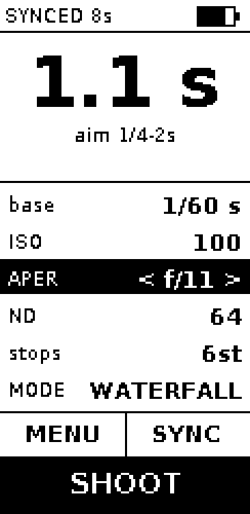
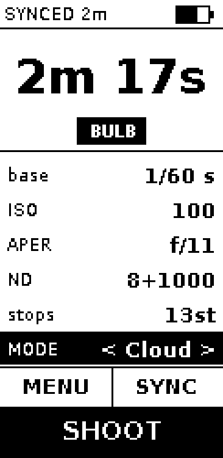
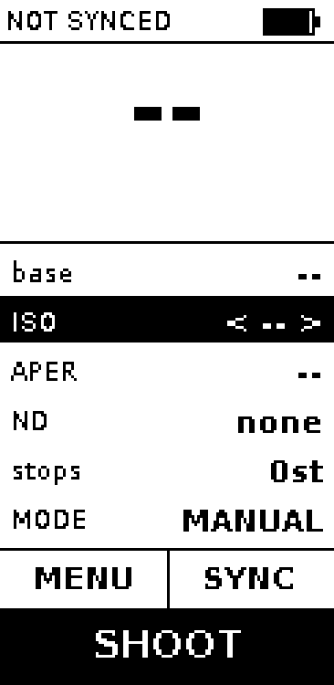
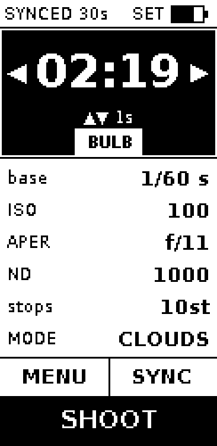
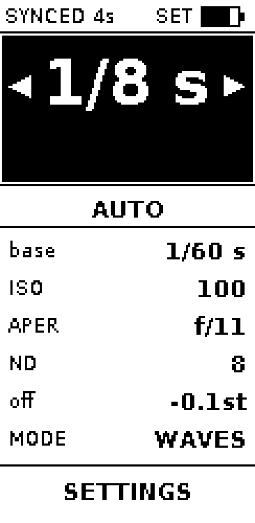
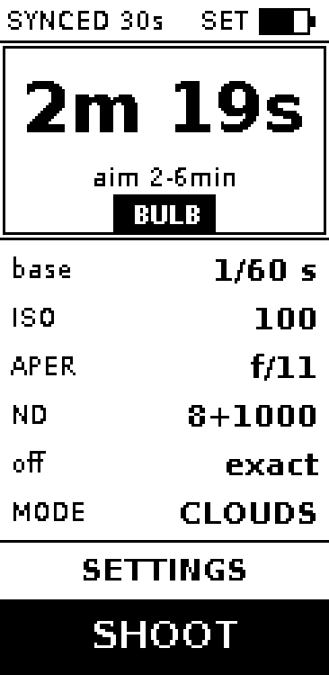
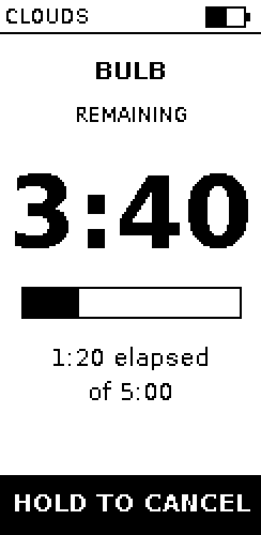

# ND Long Exposure Timer

Taking long exposure photos can be cumbersome:
- you first need to determine the correct exposure
- then calculate how much the total exposure is when you put certain ND filters on
- and then backsolve how to adjust the exposure time so that the total exposure time has the desired effect.
- then take the photo

This module will
- when you have your exposure set correctly
- sync with your camera
- let you chose the total exposure time and tell you what filters you need to put on
- no calculations or iterative backsolving required!


- **SYNC** reads ISO, aperture and shutter speed from the camera over USB
- Shifts ISO or aperture and the base shutter recomputes to hold the same exposure
- Pick a filter or a stack of filters; the final time and whether it needs BULB update as you go

## What it looks like

The display is a 2.13" e-paper panel mounted upright: 122 x 250 pixels. "selected" is shown by inverting the colors.

### Calculator

The parameter list sits above the arithmetic, which reads down to its answer. The
selected row is inverted and grows carets to show that left and right change it. At 122
pixels wide there is no room for a label beside its value, so each row stacks them.



Past 30 seconds the shot has to run on bulb, and the panel says so - the Pi is the timer
from that point on.



Before the first SYNC there is nothing to calculate from, and the device says that
rather than showing a confident wrong number.



### Setting the time by hand

The calculation is not always the shot. Press the five-way's centre on the time and the
answer becomes yours: left and right walk the camera's own third-stop ladder, up and down
move a second for the times the ladder skips. Below a second the screen stops offering them
- a second added to 1/8 is three stops, which is a jump rather than an adjustment - but the
press still works, and is often how you leave the fast end.

While the time is being set the answer is inverted and written as a clock, so a second on
or off moves a digit rather than reflowing the whole number.



The ladder runs from 1/125 to 15s, then 00:16 and whole minutes to an hour - well past what
long exposure needs at the fast end, because waves want 1/8 and a dial that reaches 1/125 is
one a self-timer can be built on later.



A hand-set time says SET in the status bar, because the rows underneath still show the
calculation it no longer agrees with. Moving ISO, aperture or ND hands the answer back to
the calculator.



### Exposing

Remaining time gets the whole column, because it is read from wherever the camera is
standing. A progress bar and the elapsed/total sit beneath it. The countdown redraws
every 10 seconds rather than every second: e-paper wears with every refresh, and on a
five-minute exposure the extra ticks buy nothing.



## Controls

| Control | Does |
|---------|------|
| Five-way up / down | move between the time and the rows; while setting the time, a second on or off |
| Five-way left / right | change the selected value; while setting the time, step it |
| Five-way centre | start or stop setting the time when it is selected, otherwise open the menu |
| SYNC | read the current exposure from the camera |
| SHOOT | start the exposure; hold to cancel a running one |

## Development

The exposure maths, the screens and the camera commands are all testable without any
hardware attached - which matters, because the Pi's only USB port cannot carry both the
camera and an ssh session.

```bash
python3 -m venv .venv && ./.venv/bin/pip install pytest pillow
./.venv/bin/python -m pytest          # includes the golden-image checks
./scripts/render-screens.py           # after a deliberate UI change, then commit the images
```

Provisioning a fresh Pi, flashing a card and driving the camera by hand are covered by
the scripts in `scripts/`.

# Bill of Materials
- five way button\
  

- Raspberry Pi Zero, it needs linux for gphoto2 
- 2.13'' E-paper display
- UPS HAT for Raspberry Pi Zero with 1000mah battery\
  

- power button 16mm diameter (latching 3 pole 1NO1NC)
- usb-c port with only power cables\
  

- micro-usb soldering plug 5 pins\
  

- usb-A port with 4 pole\
  


- 2x TLYCRQJXF Momentary Tactile Push Button, 12 x 12 x 7,3 mm\
  


- USB A ==> UC-E6 UC-E16 UC-E17 cable 
- 1/4" Camera Hot shoe Mount\
  

