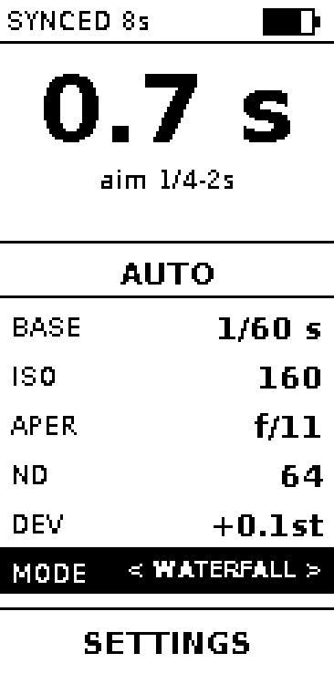
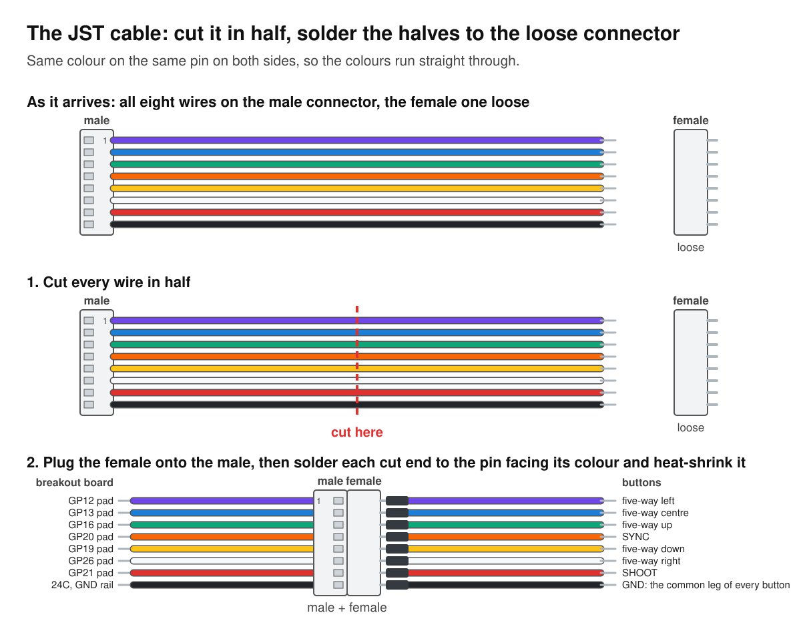
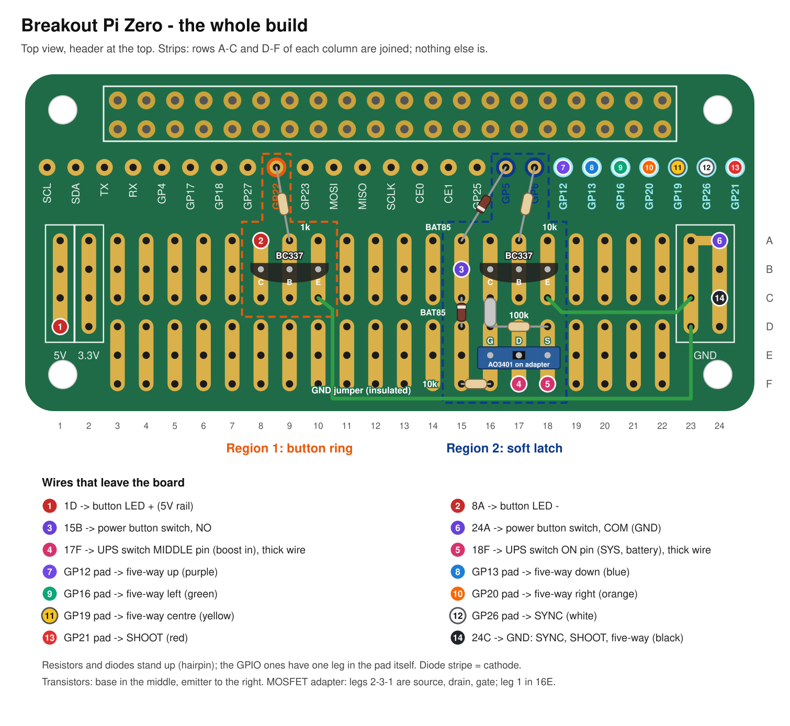
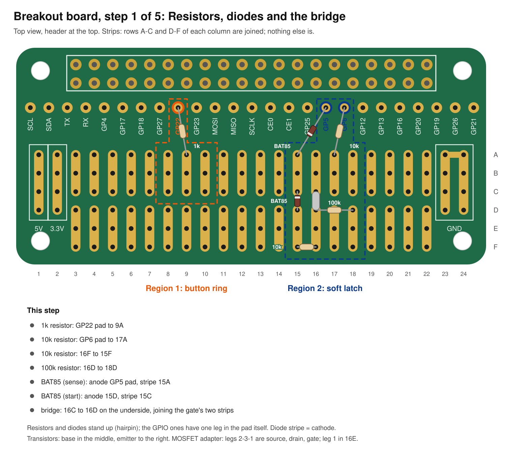
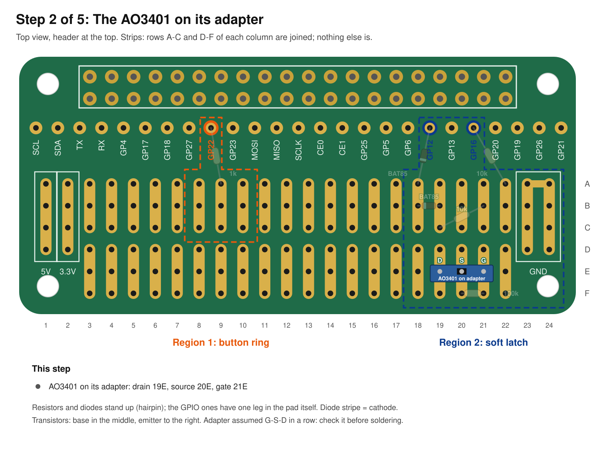
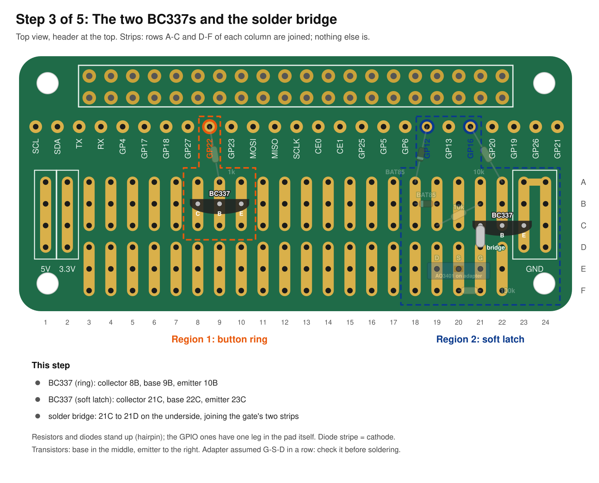
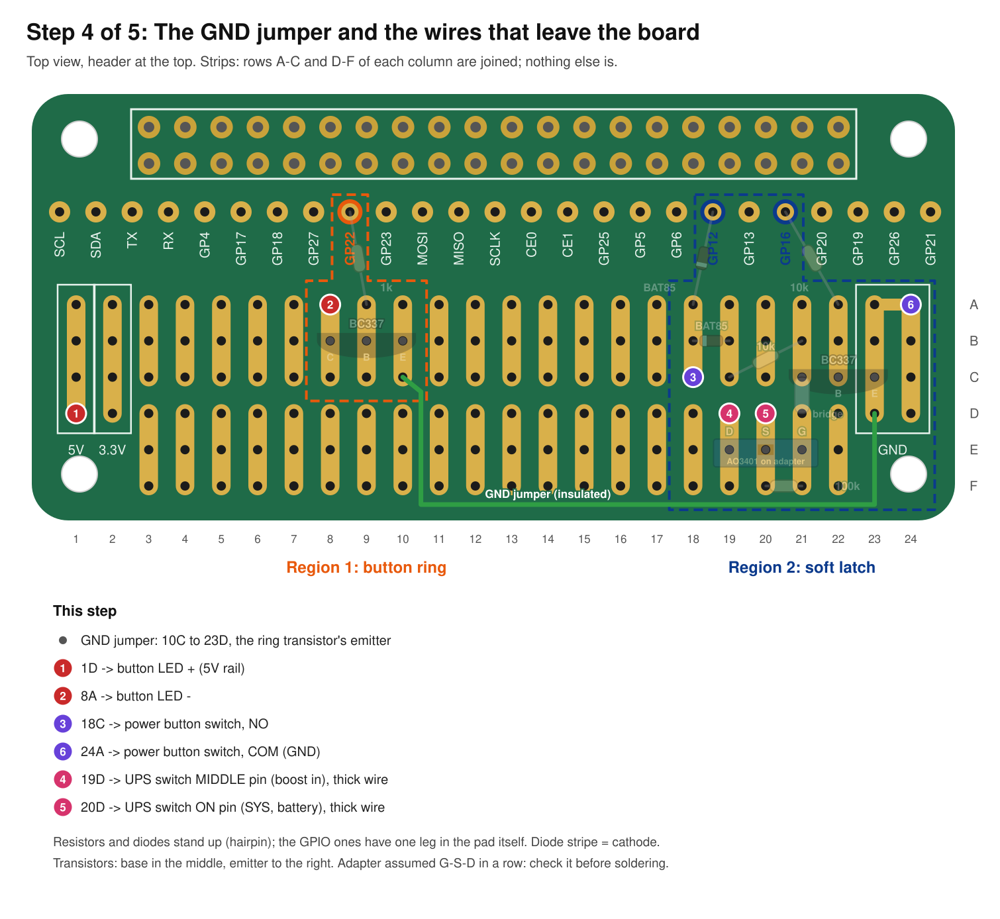
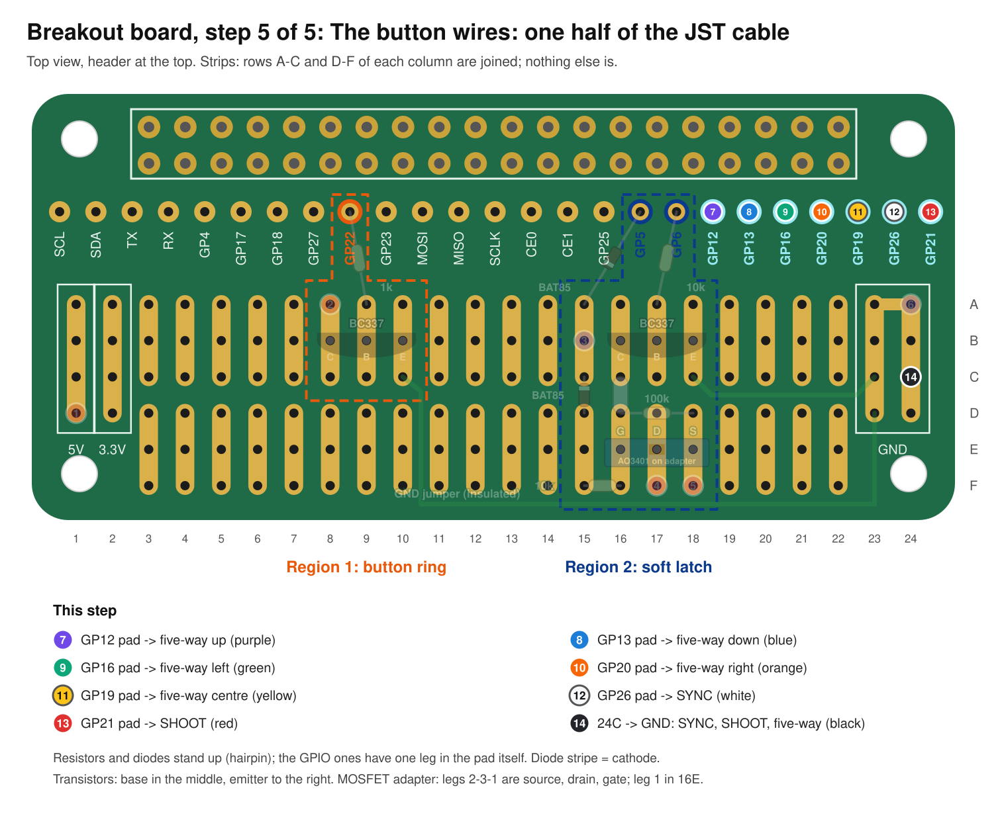
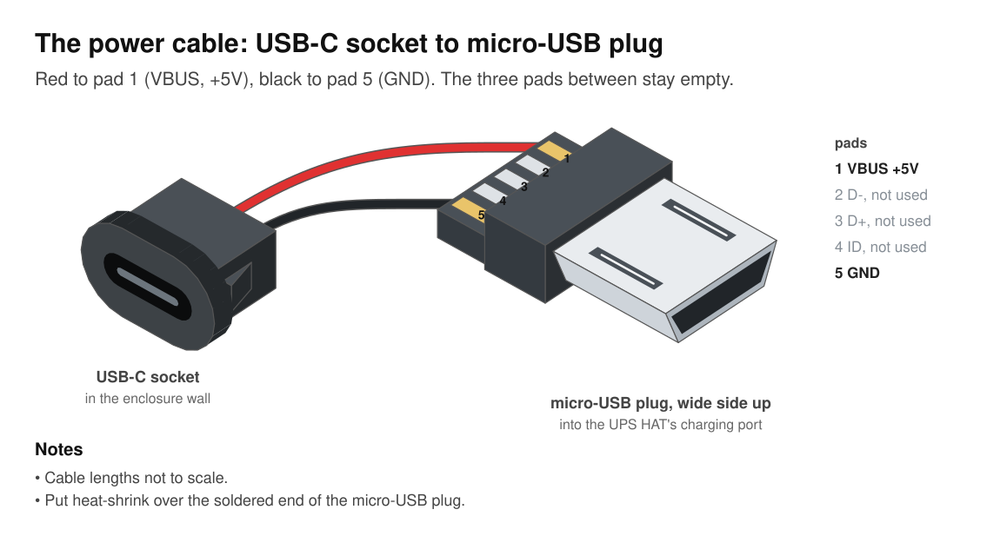

# ND Long Exposure Timer

A small box on your camera's hot shoe for long exposures with ND filters. You pick the
exposure time you want; it tells you which filters to put on and sets the ISO and
aperture to match. No maths, no guessing.

**Try it in your browser:** https://antondegroot.github.io/ND-Long-Exposure-Timer/



How it works:
1. Meter the scene on your camera as usual and press **SYNC**.
2. Pick the total exposure time.
3. Screw on the filters it lists and press **SHOOT**.

## Controls

| Control | Does |
|---------|------|
| Five-way | move |
| Five-way centre | select |
| SYNC | read the exposure from the camera |
| SHOOT | start the shot; hold to cancel |

What every screen means: [docs/screens.md](docs/screens.md).

## 1. Buy

**Cost:** about €130 for a first build, bought in the Netherlands (prices of October 2026,
with VAT, without shipping). €64 of that is the Pi, the UPS HAT, the display and the
breakout board; the rest is small parts, which mostly come in packs. If you already have
those, it comes down to about €64.

<details>
<summary>Show the parts list</summary>

| Part | Qty |
|------|-----|
| Raspberry Pi Zero 2 W (a plain Zero works, but boots in ~25s instead of ~11s) | 1 |
| 2.13" e-paper display HAT | 1 |
| UPS HAT for Pi Zero, with 1000mAh cell | 1 |
| Breakout Pi Zero (AB Electronics) | 1 |
| Five-way navigation button | 1 |
| 16mm momentary power button with LED ring (1NO1NC, 3-6V ring) | 1 |
| 12x12mm momentary tactile button (TLYCRQJXF), for SYNC and SHOOT | 2 |
| BC337 NPN transistor (TO-92) | 2 |
| AO3401 P-channel MOSFET (SOT-23) + SOT-23 to SIP3 adapter | 1 |
| BAT85 Schottky diode | 2 |
| Resistors: 1kΩ, 10kΩ, 10kΩ, 100kΩ | 4 |
| USB-C power-only socket | 1 |
| Micro-USB solder plug, 5 pin | 1 |
| USB-A socket, 4 pin | 1 |
| USB-A to camera cable (UC-E6 / UC-E16 / UC-E17) | 1 |
| 1/4" hot shoe mount | 1 |
| JST connector with 8 wires | 1 |
| Clear acrylic sheet, 1mm thick, at least 55x30mm | 1 |

Five-way button\


UPS HAT\


Power button\


Breakout board\


USB-C socket\


Micro-USB plug\


USB-A socket\


Tactile button\


SOT-23 to SIP3 adapter\


JST connector\


Hot shoe mount\


Acrylic sheet\


</details>

Tools: soldering iron, multimeter, 3D printer.

## 2. Print

The enclosure files are not in the repo yet.

## 3. Solder

<details>
<summary>Show the soldering steps</summary>

Five parts: the JST cable, the breakout board, the power cable, the data cable and the
buttons. Check each step with the multimeter before the next one.

### 3.1 JST cable
<details>
<summary>Show the JST cable</summary>

The JST cable comes with all eight wires on the male connector and the female one loose.
Cut every wire in half. Plug the female onto the male, then solder each cut end to the
female pin facing its own colour, and heat-shrink every joint. The colours then run straight
through, and the cable comes apart in the middle. The bottom of the drawing shows where
each colour goes.



</details>

### 3.2 Breakout board
<details>
<summary>Show the breakout board steps</summary>

- Holes are column then row: `21C` is column 21, row C.
- Numbered circles are wires that leave the board.



#### 3.2.1 Resistors and diodes



Stand them up. The GPIO legs go straight into the pads. Both diode stripes go in
column 15: the one from GP5 in 15A, the upright one in 15C. Then, underneath, bend the
100k's leg from 16D onto 16C and solder it: that is the bridge.

Check: 16C beeps to 16D.

#### 3.2.2 MOSFET



Solder the AO3401 onto the adapter with its pin 1 at the dot. The adapter's legs read
2-3-1, which is source, drain, gate. The leg marked `1` goes in 16E, so the drain lands
in 17E and the source in 18E.

Check: 16E, 17E and 18E don't beep to each other.

#### 3.2.3 Transistors



Measure each BC337's pinout first; makers differ. On the diode range the base reads about
0.7V to both other legs, and the emitter reads slightly higher than the collector.
Emitters go right.

Check: 8B, 9B, 10B and 16B, 17B, 18B don't beep to each other.

#### 3.2.4 Wires



Two green jumpers: one under row F, one between rows C and D. ④ and ⑤ go to the UPS
HAT's old power switch pads and
carry up to 1.5A: use thick wire. With the switch off, the ON pad reads battery voltage,
the middle pad 0V. Heat-shrink every joint.

Check: 10C and 18C beep to GND; ④ and ⑤ don't beep to each other.

#### 3.2.5 Button wires



The male half of the JST cable (3.1): purple into the leftmost pad, through red into the
rightmost, and black into ⑭ for the buttons' ground.

Check: once the buttons are on (3.5), each pad beeps to GND only while its button is
pressed.

How the circuits work, with schematics: [docs/power-button.md](docs/power-button.md).
The drawings are generated: edit `scripts/breakout_drawing/layout.py` and run
`./scripts/draw-breakout.py`.

</details>

### 3.3 Power cable
<details>
<summary>Show the power cable</summary>

The USB-C socket's red wire goes to pad 1 (VBUS) of the micro-USB plug and the black wire
to pad 5 (GND); the three pads between stay empty. The plug goes into the UPS HAT's
charging port.



With the wide side up (the side with the two latch slots) and the tip pointing away from
you, pad 1 is on the left. Check it before soldering: push the bare plug into the UPS
HAT's charging port, and pad 5 should beep to the HAT's ground. If the other outer pad
does, trust the meter and swap red and black.

</details>

### 3.4 Data cable
<details>
<summary>Show the data cable</summary>

To be written.

</details>

### 3.5 Buttons
<details>
<summary>Show the buttons</summary>

The female half of the JST cable goes to the buttons. Purple, blue, green, orange and
yellow go to the five-way's pins in its own order: up, down, left, right, centre. White
goes to SYNC and red to SHOOT. Black goes to the ground leg of SYNC and SHOOT, and a short
wire carries it on from there to the five-way's ground pin.

Find the power button's terminals with the multimeter first: `+`/`-` for the ring, and
the `COM`/`NO` pair that closes only while pressed. `NC` is not used.

</details>

</details>

## 4. Install

<details>
<summary>Show the install steps</summary>

On a Mac, with a blank SD card. Plug the Pi into the **middle** micro-USB port (`USB`),
not `PWR IN`: that one carries no data.

```bash
sudo ./scripts/flash-sd.sh ~/Downloads/raspios-lite.img.xz   # asks for a password for `pi`
# put the card in the Pi and plug it in; it shows up as 10.55.0.1
ssh-copy-id -i ~/.ssh/pi_deploy_key.pub pi@10.55.0.1
sudo ./scripts/share-internet-macos.sh                       # the Pi has no network of its own
./scripts/deploy-to-pi.sh
ssh -t pi@10.55.0.1 'cd ~/ND-Long-Exposure-Timer && sudo ./scripts/setup-pi.sh --status-led-pin 22 --shutdown-pin 5'
ssh pi@10.55.0.1 'sudo systemctl reboot'
./scripts/deploy-to-pi.sh
ssh -t pi@10.55.0.1 'sudo systemctl enable --now nd-timer'
```

`setup-pi.sh` takes 15-30 minutes. After that, `deploy-to-pi.sh` is the only thing to
rerun when the code changes.

What each step does, and what to do if the panel looks wrong: [docs/installing.md](docs/installing.md).

</details>

## Development

Run it on a laptop with `./scripts/simulator.py`, or use the browser link above. Tests,
lint and the rest: [docs/development.md](docs/development.md).
