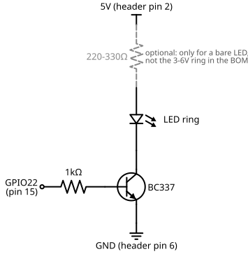
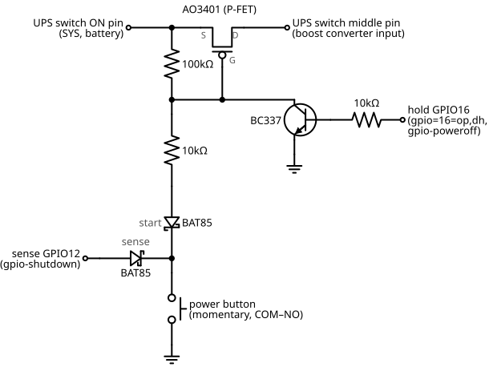

# The power button and the soft latch

How the ring and the soft latch work, and why the parts are what they are. The README has the soldering steps.

The 16mm button is momentary and does two jobs, wired separately: two terminals are the
soft latch's button (below), two more light the ring. The ring is the only thing on this
device that can say "starting" - the panel cannot be written until Linux is up, about
seventeen seconds in. See [boot-time.md](boot-time.md) for how that conclusion was arrived at.

### What the ring is for

`config.txt` carries `gpio=22=op,dh`, written by `setup-pi.sh --status-led-pin 22`. The
**firmware** applies that about a second after the button is pressed - before the kernel,
let alone the application - so the ring lights almost immediately. `main.py` then drives
the pin low once the first real screen is on the panel.

**Lit means starting. Dark means ready.** Which also keeps the enclosure dark while the
shutter is open, the same reason the Pi's own ACT LED is disabled.

### Wiring the button's LED ring as an indicator

The ring in the BOM is rated 3-6V (5V nominal), and a GPIO is 3.3V logic that should not
be asked for more than about 16mA. So the GPIO switches a transistor and the transistor
switches the ring (the schematic is under [Circuit diagrams](#circuit-diagrams)).

| Part | Value | Why |
|------|-------|-----|
| NPN transistor | BC337 or 2N3904 | Switches the 5V ring from a 3.3V pin. Either is far over-rated for ~20mA, which is what you want. |
| Base resistor | 1kΩ | ~2.5mA into the base. With any hFE over about 40 the transistor is fully on, and the GPIO stays well inside its limit. |
| Series resistor | 220-330Ω, **only if the ring has no built-in resistor** | Not needed for the ring in the BOM: a 3-6V rating is only possible with a resistor already inside. Putting a second one in series dims it; leaving one out of a bare LED destroys it. |

**Check the transistor's pinout before soldering, on the part you actually have.** This is
the mistake to make, and it cannot be answered from the part number alone: a 2N3904 in
TO-92 is Emitter-Base-Collector left to right with the flat face towards you, a BC547 is
Collector-Base-Emitter - the reverse - and BC337 datasheets disagree with each other
depending on who made it. Getting it backwards gives a ring that never lights and a
transistor that gets warm.

Two minutes with a multimeter settles it. On the diode range, the **base** is the one pin
that reads a junction to both of the others (about 0.7V). On an NPN the base is the
positive probe for both of those readings; the pin that reads slightly *higher* from the
base is the emitter.

### Order of work

1. **Identify the button's terminals** before anything is soldered. The two LED terminals
   are usually marked `+` and `-`; the switch terminals are `COM`, `NO` and `NC`. Put a
   multimeter on continuity across `COM` and `NO` and press the button: closed only while
   it is held. That is the pair the soft latch uses; `NC` stays unconnected.
2. **Test the ring on the bench** before it is in the circuit, to find its polarity. The
   3-6V ring in the BOM can take 5V straight across it. A ring without a rating goes
   through 330Ω first: bright means it has no resistor of its own, dim means it does.
3. **Solder the button first**, while it is loose and you can turn it over. Tin each wire,
   heat the terminal rather than the solder, and heat-shrink each joint: these are the
   joints that take the strain of the switch being pressed.
4. **The transistor lives on the breakout board** (the README's soldering steps), not in mid-air: a dead bug of
   components hanging off a button will fail in a camera bag. Only the four wires ① ② ③ ⑥
   go to the button.

### Checking it

With the ring wired and nothing else changed:

```bash
# Lit from about a second after switch-on, until the first screen is drawn.
ssh nd-timer 'journalctl -u nd-timer -b | grep -i "status led"'
```

No output means the pin was claimed and the ring is being driven. A line saying
`status led on pin 22 unavailable:` means the app could not claim it - the ring will stay
lit, which is harmless but wrong, and the message says why.

To see the pin state directly, `raspi-gpio get 22` (from the `raspi-gpio` package). Note
the application holds that pin while it runs, so a second process reading it gets
`GPIO busy`.

### Not built yet: switching the power in software

The latching switch cuts the rail, so the Pi is never told it is about to lose power. That
is why there is no "shutting down" frame on the panel, and why the panel holds a stale
screen from the last session.

A soft latch fixes it: a momentary button starts the Pi, a P-channel MOSFET holds the rail
up, and the Pi drops it when it has finished writing to the panel. The momentary 16mm
button in the BOM replaces the latching one for this, so the ring stays on the same button.

It is one button on two GPIOs: a **hold** line the Pi drives to keep the rail up, and a
**sense** line it reads to know the button was pressed again. `setup-pi.sh
--shutdown-pin` is the sense half of this circuit, not a separate way of doing it.

**Where it goes.** On the Waveshare UPS HAT (C) the on-board ON/OFF slide switch - the
one the latching button replaced - does not switch the 5V. It switches the battery side
(SYS, about 3.0-4.2V, a little more while charging) into the TPS61088 boost converter that
makes the 5V. Its three pads, from Waveshare's schematic:

| Switch pad | Connects to | In the soft latch |
|------------|-------------|-------------------|
| **ON pin** (end) | SYS, the battery side | MOSFET Source, and the 100k |
| **Middle pin** | the boost converter's input | MOSFET Drain |
| **OFF pin** (other end) | the boost input too, same as the middle | nothing |

Sliding to ON joins the middle pin to the ON pin; sliding to OFF joins it to the OFF pin,
which is already the same wire, so nothing is powered. The latching button is across the
ON and middle pins now, and the soft latch goes on the same two. That leaves the pogo pins
alone, and with the boost converter unpowered it stops drawing from the cell while stored.

**The OFF pin is not used - leave it unconnected.** It has no job: the switch has three
legs and the circuit only needs two, which is presumably why Waveshare tied the spare one
to the middle pin.
Charging does not go through it either. The charger sits before the switch, between the
micro-USB and the battery, so the cell still charges with the Pi off.

The schematic does not say which end of the board is which, so measure before soldering:
with the latching button released, the ON pin reads battery voltage to GND, and the
middle and OFF pins read about 0V. The schematic is under [Circuit diagrams](#circuit-diagrams).

- **Starting:** the button pulls the gate low through its diode and the rail comes up.
  The hold line is GPIO6, which the Pi pulls up by default from the moment it has power,
  so the latch catches within milliseconds and a short press is enough. The firmware
  then makes it a driven output with `gpio=6=op,dh`.
- **Stopping:** a second press pulls the sense GPIO low through the other diode, and
  `gpio-shutdown` starts a clean poweroff - which is when the shutdown frame gets drawn.
  At the very end `dtoverlay=gpio-poweroff,gpiopin=6,active_low=1` drops the hold line
  and the rail goes with it.
- **The two diodes** both point at the button: stripe (cathode) on the button side. It
  needs two. While the Pi runs, the BC337 holds the gate at about 0V; with one diode the
  button's side would sit there too, and hold the sense GPIO near its threshold the whole
  time. With two, the released button's side is connected to nothing, so the sense GPIO
  stays high until the button is actually pressed. The sense diode also keeps SYS, up to
  about 4.4V, off a 3.3V pin while the Pi is off.
- **Schottky, not silicon.** A pressed button leaves the sense GPIO at the diode's forward
  voltage: about 0.2-0.3V through a BAT85, 0.5-0.6V through a 1N4148 or 1N4001. The Pi
  reads below about 0.8V as low, so both work, but the Schottky leaves the margin.
- **Gate drive and heat.** The gate sees SYS, not 5V, so the MOSFET is driven with only
  3.0-4.2V. The AO3401 is specified down to 2.5V (about 85mΩ there), which is why it is
  the one to buy. Current is also higher on this side of the boost: about 0.4A
  typically, up to about 1.5A for a 1A load on a nearly flat cell. That is about 0.2W,
  some 25°C over ambient on a SOT-23 - no heatsink, and the adapter's copper helps.

The sense pin is not pin 3 on this build, for the reason in `setup-pi.sh --help`: it is
I2C SCL, which the UPS HAT's fuel gauge needs. Pin 3's wake-from-halt is no use here
anyway, because the soft latch removes power rather than halting. `setup-pi.sh` always
writes both hold-line settings for BCM6; the sense line, GPIO5, needs `--shutdown-pin 5`.

The default pull-up is also what keeps a reboot from switching the device off: the GPIOs
reset while the firmware restarts, and GPIO6 goes back to pulled up rather than to low.
A pin above 8 would be pulled down there, and the rail would go with it.

The latching button comes off the ON and middle pins and the soft latch is the only switch.
Off, the MOSFET leaks microamps, so storage drain is about what a hard switch gives.

## Circuit diagrams

### Button ring



### Soft latch


